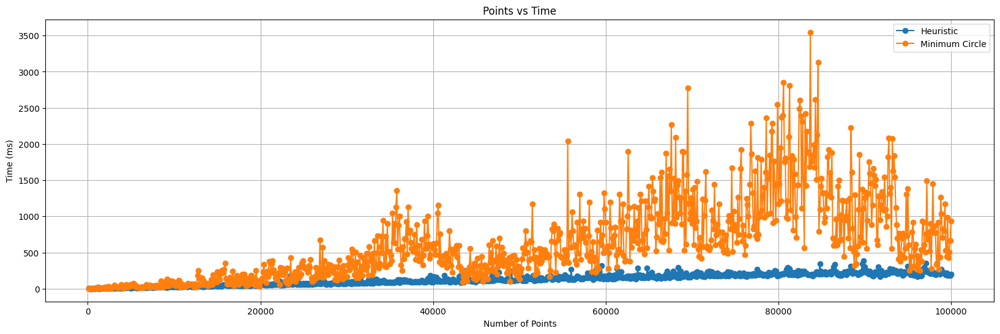

# Trabalho Prático 01 - Círculo Mínimo

| Informação  | Detalhes    |
| ----------- | ----------- |
| Disciplina  | Geometria Computacional (`INF2604`) |
| Professor   | Waldemar Celes (<celes@inf.puc-rio.br>) |
| Aluno       | Gabriel Ribeiro Gomes (<ggomes@inf.puc-rio.br>, <ribeiroggabriel@gmail.com>) |

## Sumário

- [Introdução](#introdução)
- [Implementação do Algoritmo](#implementação-do-algoritmo)
  - [Algoritmo Heurístico](#algoritmo-heurístico)
  - [Algoritmo do Círculo Mínimo](#algoritmo-do-círculo-mínimo)
- [Resultados de Performance](#resultados-de-performance)
- [Conclusão](#conclusão)

## Introdução

Este documento apresenta um relatório sobre a implementação de algoritmos para encontrar o círculo mínimo que engloba um conjunto de pontos em um plano 2D. O relatório inclui os detalhes de implementação e resultados obtidos a partir de simulações.

O principal objetivo deste relatório é analisar e comparar a performance do algoritmo heurístico em relação ao algoritmo exato do círculo mínimo. Ambos algoritmos possuem complexidade $O(n)$, onde:

- O algoritmo heurístico é uma abordagem mais simples em implementação, mas pode não garantir a solução ótima em todos os casos.
- O algoritmo do círculo mínimo, embora mais complexo, assegura a obtenção do círculo mínimo que engloba todos os pontos.

Para validação dos pontos, foi gerado um conjunto de pontos aleatórios dentro de um círculo de raio 5, centrado em (10, 10). A seguir, vemos a nuvem de pontos aleatórios gerados:


E abaixo, vemos o círculo de raio 5, centrado em (10, 10), que foi utilizado para gerar os pontos:


Apesar do círculo de raio 5 ter sido utilizado para gerar os pontos, eles foram distribuídos aleatoriamente dentro desse círculo, o que significa que a distribuição dos pontos não é uniforme. Portanto, o círculo mínimo que engloba todos os pontos pode ser significativamente menor que o círculo de raio 5, e confirmamos isso com os resultados obtidos na sequência.

## Implementação do Algoritmo

A implementação dos algoritmos foi realizada em Python, utilizando bibliotecas como `numpy` para manipulação de arrays e `matplotlib` para visualização gráfica. O código completo pode ser encontrado no arquivo `minimum_circle.ipynb`. Além disso, diversos conceitos de Python foram aplicados nessas simulações, como a utilização de tipos personalizados com a bibliteca `Pydantic` e a criação de interfaces aplicáveis para os objetos "Ponto" e "Círculo". O código abaixo ilustra a definição dessas classes. Para círculo:

```python
class Circle(BaseModel):
    """Represents a circle in the plane (center_x, center_y, radius)"""
    center_x: float
    center_y: float
    radius: float

    @field_validator("radius")
    def radius_must_be_positive(cls, radius_value):
        if radius_value <= 0:
            raise ValueError("Radius must be positive")
        return radius_value
```

E para um ponto/vetor no plano:

```python
class Point(BaseModel):
    """Represents a point in the plane (x, y)"""
    x_coordinate: float
    y_coordinate: float

    def norm(self) -> float:
        """Calculates the Euclidean norm (magnitude) of the point."""
        return math.hypot(self.x_coordinate, self.y_coordinate)
```

Além disso, foi criada uma classe `CircleSimulationData` que recebe um objeto do tipo círculo e um parâmetro `n_points` inteiro que permite que simulemos a geração de `n_points` pontos aleatórios dentro do círculo, respeitando a distribuição uniforme. Abaixo está o trecho do código que implementa essa funcionalidade:

```python
class CircleSimulationData:
    def __init__(self, circle: Circle, rng: np.random.Generator | None = None) -> None:
        self.circle = circle
        self.rng = rng or np.random.default_rng()

    def generate_point_cloud(self, n_points: int) -> list[Point]:
        points = []
        for _ in range(n_points):
            r = self.rng.uniform(0, self.circle.radius)
            theta = self.rng.uniform(0, 2 * math.pi)
            x = self.circle.center_x + r * math.cos(theta)
            y = self.circle.center_y + r * math.sin(theta)
            point = Point(x_coordinate=x, y_coordinate=y)
            points.append(point)
        return np.array(points)
```

Matematicamente, para garantir que os pontos sejam distribuídos uniformemente dentro do círculo, utilizamos a fórmula polar para converter coordenadas polares em coordenadas cartesianas. A variável $r$ é gerada de forma que a densidade de pontos seja uniforme em toda a área do círculo, e $\theta$ é o ângulo em radianos que determina a direção do ponto a partir do centro do círculo.

$$
\begin{bmatrix} x \\ y \end{bmatrix} =
\begin{bmatrix} center_x \\ center_y \end{bmatrix} +
r \cdot \begin{bmatrix} \cos(\theta) \\ \sin(\theta) \end{bmatrix},
\quad r \in [0, radius], \; \theta \in [0, 2\pi]
$$

Com essa base definida, conseguimos gerar os pontos aleatórios dentro do círculo de maneira eficiente e reutilizável, e ter rastreabilidade que os pontos não vão ser criados de maneira diferente a cada execução, caso um `rng` seja passado para o construtor da classe. Além disso, adiciona uma camada extra de segurança na validação dos dados, garantindo que os pontos e círculos criados estejam sempre dentro desse primeiro círculo, o que nos garante que o $r$ encontrado pelo algoritmo heurístico vai ser aproximadamente o $r$ do círculo da simulação, e o $r$ encontrado pelo algoritmo do círculo mínimo vai ser menor ou igual ao $r$ do círculo da simulação.

### Algoritmo Heurístico

Para o algoritmo heurístico, utilizamos uma função Python que calcula o círculo mínimo aproximado. A função percorre os pontos, atualizando o centro e o raio do círculo conforme necessário.


Para o círculo de raio 5, centrado em (10, 10), o algoritmo heurístico apresentou o seguinte resultado:

- Centro: (10.29, 9.90), estando bem próximo do centro real (10, 10).
- Raio: 5.12, que é ligeiramente maior que o raio real (5), o que é esperado em um algoritmo heurístico.

Isso valida nossa hipótese de que o algoritmo heurístico pode não encontrar o círculo mínimo exato, mas chega perto.

### Algoritmo do Círculo Mínimo

Agora para o algoritmo do círculo mínimo, implementamos uma classe completa em Python, devido ao número grande de funções auxiliares necessárias para garantir a correta implementação do algoritmo. Repetindo o processo de simulação com o mesmo conjunto de pontos, o algoritmo do círculo mínimo apresentou o seguinte resultado:


Para o mesmo círculo de raio 5, centrado em (10, 10), o algoritmo do círculo mínimo apresentou o seguinte resultado:

- Centro: (10.03, 9.97), que está muito próximo do centro real (10, 10).
- Raio: 4.88, que é menor que o raio real (5), confirmando que o algoritmo encontrou o círculo mínimo que engloba todos os pontos.

Com isso, validamos a implementação dos nossos algoritmos e podemos prosseguir para a análise de performance.

## Resultados de Performance

Quanto a performance, foi utilizado um configuração de simulação com os seguintes parâmetros: 1000 simulações, todas com 100\*n pontos, onde n é o número da simulação (variando de 1 a 1000). Para realizar a simulação de maneira eficiente, foi utilizada a biblioteca `multiprocessing` do Python, que permite a execução paralela de processos, aproveitando múltiplos núcleos da CPU.
Abaixo podemos ver o resultado condensado da execução dos dois algoritmos, onde cada ponto representa o tempo médio de execução dos dois algoritmos para um número específico de pontos.



E abaixo podemos ver o resultado separado da execução dos algoritmos, com as escalas ajustadas para melhor visualização dos dados e a representação de uma reta representando a complexidade $O(n)$ dos algoritmos.


Onde podemos ver que ambos os algoritmos seguem a complexidade $O(n)$, mas o algoritmo heurístico é significativamente mais rápido que o algoritmo do círculo mínimo, especialmente à medida que o número de pontos aumenta.

## Conclusão

Neste trabalho, implementamos e analisamos dois algoritmos para determinar o círculo mínimo que envolve um conjunto de pontos em um plano: uma versão heurística e a versão exata. Os experimentos mostraram que ambos possuem complexidade assintótica $O(n)$, mas com diferenças claras em termos de precisão e desempenho. O algoritmo heurístico demonstrou ser mais simples e eficiente em tempo de execução, especialmente para conjuntos grandes de pontos. Contudo, como esperado, ele não garante a solução ótima, resultando em raios ligeiramente maiores que o círculo mínimo real. Já o algoritmo do círculo mínimo garantiu a solução correta em todos os testes, encontrando raios menores ou iguais ao valor de referência. Apesar disso, apresentou maior custo computacional quando comparado ao heurístico, confirmando o trade-off entre exatidão e velocidade.
