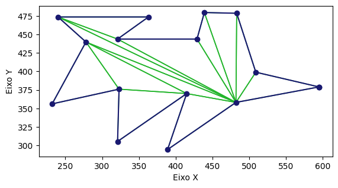

# Trabalho Prático 02 - Triangulação de Polígonos

| Informação  | Detalhes    |
| ----------- | ----------- |
| Disciplina  | Geometria Computacional (`INF2604`) |
| Professor   | Waldemar Celes (<celes@inf.puc-rio.br>) |
| Aluno       | Gabriel Ribeiro Gomes (<ggomes@inf.puc-rio.br>, <ribeiroggabriel@gmail.com>) |

## Sumário

- [Introdução](#introdução)
- [Implementação do Algoritmo](#implementação-do-algoritmo)
- [Resultados do Algoritmo](#resultados-do-algoritmo)
- [Conclusão](#conclusão)

## Introdução

A triangulação de um polígono simples (sem furos e sem auto-interseções) consiste em particioná-lo em triângulos não sobrepostos cujas uniões recobrem exatamente a região do polígono.

Neste trabalho, implementei e avaliei o método clássico de Ear Clipping. A ideia central é identificar, a cada passo, um triângulo formado por três vértices consecutivos do polígono, onde:

1) o vértice central é convexo; e
2) nenhum outro vértice do polígono fica estritamente dentro desse triângulo.

Ao remover iterativamente essas orelhas, a cadeia poligonal encolhe até restar um único triângulo. Esse método possui custo assintótico $O(n^2)$.

## Implementação do Algoritmo

O algoritmo implementado segue os passos abaixo:

1. Orientação: verificar se os vértices estão no sentido anti-horário; se não estiverem, inverter a lista.
2. Busca de orelha: para cada tripla de vértices consecutivos $(v_{i-1}, v_i, v_{i+1})$:
   - testar convexidade via sinal do produto vetorial;
   - testar conteúdo: garantir que nenhum outro vértice do polígono está no interior do triângulo $(v_{i-1}, v_i, v_{i+1})$.
3. Clipping: ao encontrar uma orelha, adicionar o triângulo à saída e remover $v_i$ do polígono corrente.
4. Repetição: continuar até restarem três vértices.

Por fim, esse processo é replicado para os formatos de polígono fornecidos no enunciado e dois outros polígonos adicionais. O código pode ser encontrado no [notebook de implementação](polygon_triangulation.ipynb). O código está dividido entre os _imports_ básicos, funções auxiliares como `cross`, `signed_area`, `is_clockwise`, entre outras, funções principais como `find_ear` e `triangulate`, funções de visualização como `draw_polygon` e `draw_triangulation`, e a seção de experimentos.

## Resultados do Algoritmo

Iniciando com dois formatos mais simples, como o de "seta" e um formato de letra "C", o algoritmo conseguiu triangulá-los corretamente, como pode ser visto nas imagens abaixo:

Valores de simulação para a seta:

- Número de vértices: 8
- Número de triângulos: 6
- Área total do poígono: 1300 px²
- Área total dos triângulos: 1300 px²

Valores de simulação para a letra C:

- Número de vértices: 8
- Número de triângulos: 6
- Área total do poígono: 1300 px²
- Área total dos triângulos: 1300 px²

Agora, replicando os formatos mais complexos dados no enunciado, o algoritmo também conseguiu triangulá-los corretamente, como pode ser visto nas imagens abaixo:

Valores de simulação para o polígono complexo 1:

- Número de vértices: 15
- Número de triângulos: 13
- Área total do poígono: 30827,50 px²
- Área total dos triângulos: 30827,50 px²

Valores de simulação para o polígono complexo 2:

- Número de vértices: 20
- Número de triângulos: 18
- Área total do poígono: 64914,50 px²
- Área total dos triângulos: 64914,50 px²

## Conclusão

O método de Ear Clipping mostrou-se adequado para triangulação de polígonos simples, oferecendo:

- Simplicidade de implementação e clareza didática;
- Robustez prática para instâncias com concavidades e colinearidades moderadas, com a heurística de remoção por área local;
- Correção verificada empiricamente pelo balanceamento de áreas (área do polígono versus soma das áreas dos triângulos).
