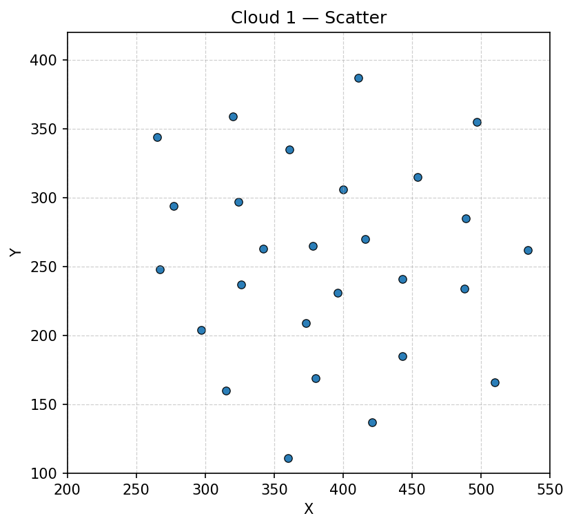
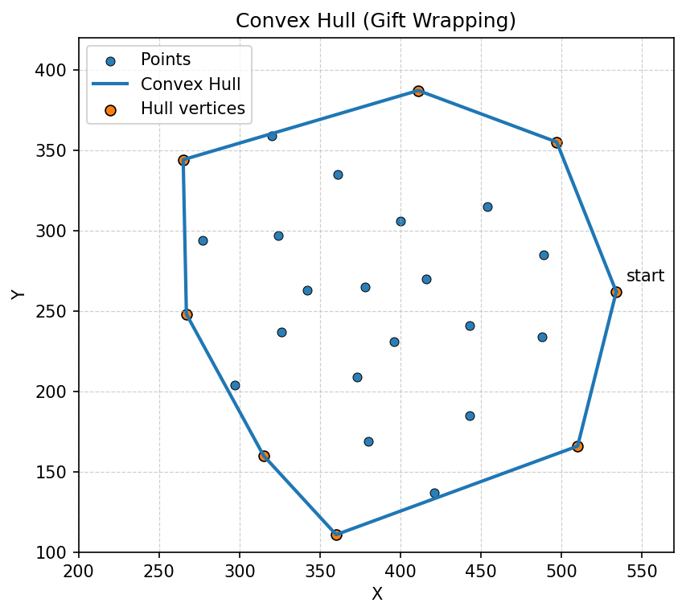
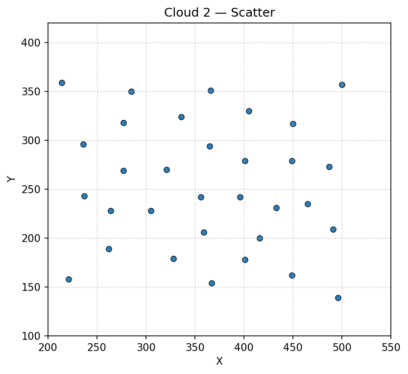
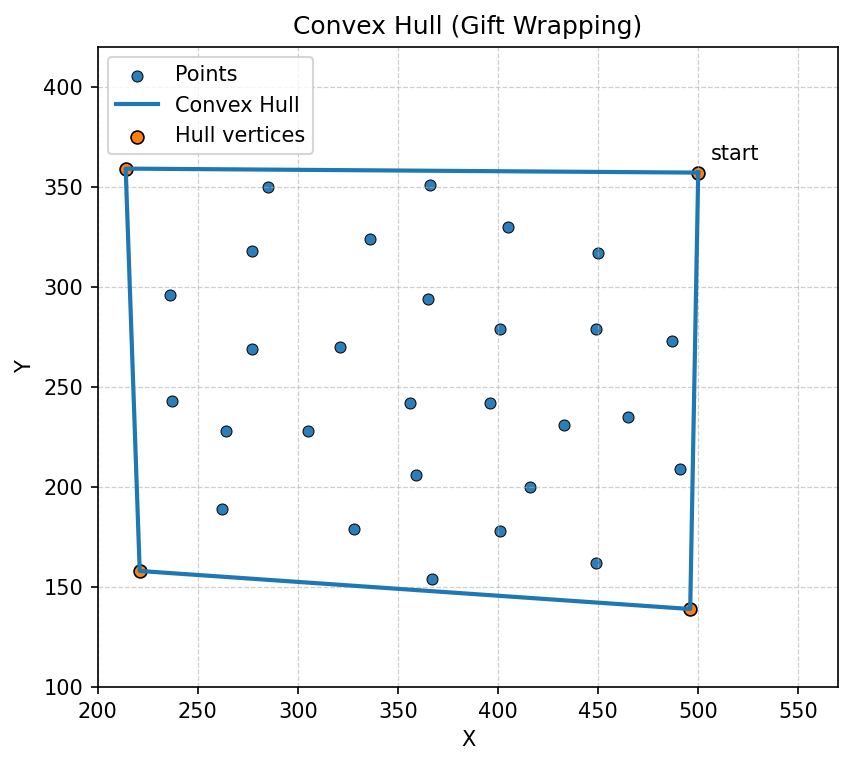
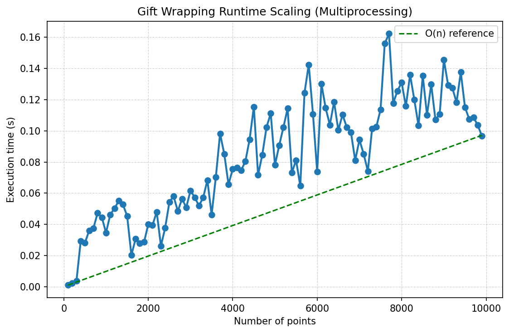

# Trabalho Prático 03 - Fecho Convexo 2D

| Informação  | Detalhes    |
| ----------- | ----------- |
| Disciplina  | Geometria Computacional (`INF2604`) |
| Professor   | Waldemar Celes (<celes@inf.puc-rio.br>) |
| Aluno       | Gabriel Ribeiro Gomes (<ggomes@inf.puc-rio.br>, <ribeiroggabriel@gmail.com>) |

## Sumário

- [Introdução](#introdução)
- [Implementação do Algoritmo](#implementação-do-algoritmo)
- [Resultados de Performance](#resultados-de-performance)
- [Conclusão](#conclusão)

## Introdução

Esse trabalho tem como objetivo avaliar a implementação de um algoritmo para determinação do fecho convexo em um conjunto de pontos no plano 2D. O fecho convexo é o menor polígono convexo que pode conter todos os pontos do conjunto. Para isso, foi utilizado o algoritmo conhecido como _Gift Wrapping_, que constrói o fecho convexo de forma incremental, selecionando os pontos que formam a "casca" do conjunto. A complexidade do algoritmo é $O(n*h)$, onde n é o número de pontos no conjunto e h é o número de pontos no fecho convexo.

## Implementação do Algoritmo

O algoritmo implementado segue os passos abaixo:

1. Identificação do ponto mais à esquerda (com menor coordenada x) como ponto inicial do fecho convexo.
2. Iterativamente, selecionar o próximo ponto que forma o menor ângulo com a linha formada.
3. Repetir o processo até retornar ao ponto inicial, completando o fecho convexo.

O código pode ser encontrado no [notebook de implementação](2d_convex_hull.ipynb). O código está dividido entre os _imports_ básicos, funções auxiliares, a função principal, funções de visualização, a seção de experimentos e as simulações de performance onde medimos o tempo de execução para diferentes tamanhos de conjuntos de pontos, com o objetivo de observar empiricamente a complexidade do algoritmo.

## Resultados do Algoritmo

Para montar as nuvens de pontos de teste, utilizamos listas de tuplas representando as coordenadas (x, y) dos pontos. A seguir, apresento os resultados obtidos com o algoritmo implementado.

### Experimento com a primeira nuvem de pontos (`cloud1`)

Para a primeira nuvem de pontos, temos o seguinte conjunto diagramado:



Onde o algoritmo encontrou a seguinte sequência de pontos formando o fecho convexo:



E os pontos em questão são:

```plaintext
Vertex 0 counter-clockwise: cloud1[26]=(534, 262)
Vertex 1 counter-clockwise: cloud1[24]=(497, 355)
Vertex 2 counter-clockwise: cloud1[21]=(411, 387)
Vertex 3 counter-clockwise: cloud1[18]=(265, 344)
Vertex 4 counter-clockwise: cloud1[17]=(267, 248)
Vertex 5 counter-clockwise: cloud1[15]=(315, 160)
Vertex 6 counter-clockwise: cloud1[20]=(360, 111)
Vertex 7 counter-clockwise: cloud1[25]=(510, 166)
```

### Experimento com a segunda nuvem de pontos (`cloud2`)

Para a segunda nuvem de pontos, temos o seguinte conjunto diagramado:



Onde o algoritmo encontrou a seguinte sequência de pontos formando o fecho convexo:



E os pontos em questão são:

```plaintext
Vertex 0 counter-clockwise: cloud2[31]=(500, 357)
Vertex 1 counter-clockwise: cloud2[4]=(214, 359)
Vertex 2 counter-clockwise: cloud2[0]=(221, 158)
Vertex 3 counter-clockwise: cloud2[18]=(496, 139)
```

## Resultados de performance

Foram realizadas simulações para conjuntos de pontos de tamanhos variados, medindo o tempo de execução do algoritmo. Abaixo podemos ver um resumo dos resultados obtidos:

| Número de Pontos | Tempo de Execução (s) |
|------------------|-----------------------|
| 1000             | 0.0346                |
| 2000             | 0.0400                |
| 3000             | 0.0616                |
| 4000             | 0.0755                |
| 5000             | 0.0781                |
| 6000             | 0.0737                |
| 7000             | 0.0943                |
| 8000             | 0.1310                |
| 9000             | 0.1456                |

E na figura abaixo, toda a curva de performance:



Mostrando que de fato o algoritmo se comporta moderadamente pior do que linear, como esperado pela complexidade teórica $O(n*h)$.

## Conclusão

A implementação do algoritmo de Gift Wrapping para determinação do fecho convexo em um conjunto de pontos 2D foi bem-sucedida. Os resultados de performance indicam que o algoritmo se comporta conforme a complexidade teórica esperada, especialmente para conjuntos de pontos maiores. A visualização dos resultados também confirma a correta formação do fecho convexo. Futuramente, seria interessante explorar outros algoritmos para fecho convexo, como o QuickHull ou Graham Scan, para comparar eficiência e desempenho em diferentes cenários.
