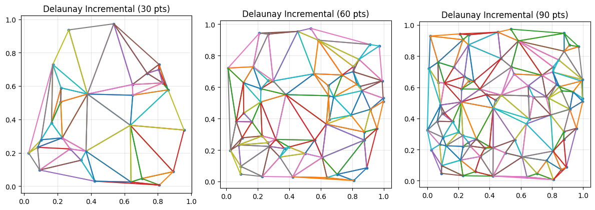
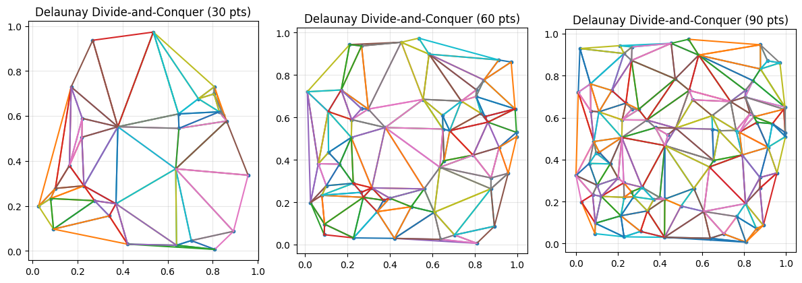
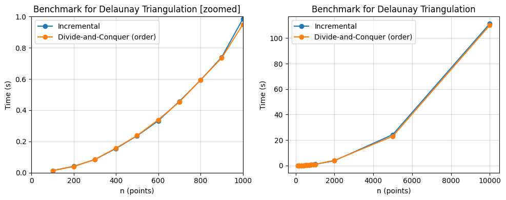

# Trabalho Prático 04 - Triangulação de Delaunay

| Informação  | Detalhes    |
| ----------- | ----------- |
| Disciplina  | Geometria Computacional (`INF2604`) |
| Professor   | Waldemar Celes (<celes@inf.puc-rio.br>) |
| Aluno       | Gabriel Ribeiro Gomes (<ggomes@inf.puc-rio.br>, <ribeiroggabriel@gmail.com>) |

## Sumário

- [Introdução](#introdução)
- [Implementação dos Algoritmos](#implementação-dos-algoritmos)
- [Resultados do Algoritmo](#resultados-do-algoritmo)
- [Resultados de Performance](#resultados-de-performance)
- [Conclusão](#conclusão)

## Introdução

Este trabalho avalia a implementação da Triangulação de Delaunay em 2D, considerando um conjunto de pontos em posições arbitrárias (isto é, sem degenerações). A Triangulação de Delaunay para um conjunto de pontos $P$ no plano é a triangulação cuja circunferência de qualquer triângulo não contém pontos de $P$ em seu interior. Essa triangulação maximiza o menor ângulo entre todos os triângulos, reduzindo triângulos muito agudos, e é dual do diagrama de Voronoi.

## Implementação dos Algoritmos

A implementação considerada no notebook `delaunay.ipynb` segue os passos padrão para Delaunay. Foram exploradas duas abordagens canônicas:

1. **Incremental**: insere pontos um a um; para cada ponto, identifica-se o conjunto de triângulos cuja circunferência o contém (complexo de conflito), remove-se estes triângulos e reconecta-se o ponto às arestas da cavidade resultante.
2. **Divide and Conquer (Dividir-e-Conquistar)**: ordena os pontos, resolve recursivamente as metades esquerda e direita e realiza a *mescla* por meio das tangentes comuns, executando *edge flips* para garantir a condição de Delaunay.

Estruturalmente, o *notebook* organiza funções auxiliares, rotinas principais de triangulação, além de rotinas de visualização para inspecionar o resultado.

## Resultados do Algoritmo

Para a execução, geramos 3 conjuntos pontos aleatórios dentro de um quadrado unitário, contendo 30, 60 e 90 pontos cada, e depois calculamos a triangulação de Delaunay usando ambas as abordagens:

```Python
points_30 = random_points(30, seed=42)
points_60 = random_points(60, seed=42)
points_90 = random_points(90, seed=42)

tris_inc_30 = triangulate_incremental(points_30.copy())
tris_dc_30 = triangulate_divide_and_conquer(points_30.copy())

tris_inc_60 = triangulate_incremental(points_60.copy())
tris_dc_60 = triangulate_divide_and_conquer(points_60.copy())

tris_inc_90 = triangulate_incremental(points_90.copy())
tris_dc_90 = triangulate_divide_and_conquer(points_90.copy())
```

A seguir, figuras exportadas do *notebook* com amostras de triangulações e inspeções intermediárias:



```Python
Report for 30 points:
{'n': 30, 'h': 11, 'triangles_expected': 47, 'triangles_observed': 47, 'edges_expected': 76}
Report for 60 points:
{'n': 60, 'h': 16, 'triangles_expected': 102, 'triangles_observed': 102, 'edges_expected': 161}
Report for 90 points:
{'n': 90, 'h': 17, 'triangles_expected': 161, 'triangles_observed': 161, 'edges_expected': 250}

```



```Python
Report for 30 points:
{'n': 30, 'h': 11, 'triangles_expected': 47, 'triangles_observed': 47, 'edges_expected': 76}
Report for 60 points:
{'n': 60, 'h': 16, 'triangles_expected': 102, 'triangles_observed': 102, 'edges_expected': 161}
Report for 90 points:
{'n': 90, 'h': 17, 'triangles_expected': 161, 'triangles_observed': 161, 'edges_expected': 250}
```

Os pontos gerados para ambas as abordagens são idênticos, e as triangulações resultantes possuem o mesmo número de triângulos e arestas, conforme esperado. Abaixo, vamos avaliar se existem alterações de desempenho entre as duas abordagens.

## Resultados de Performance

A tabela abaixo sumariza os tempos médios de execução (em segundos) para ambas as implementações, considerando conjuntos de pontos gerados aleatoriamente em um quadrado unitário.

| n | Incremental (s) | Divide & Conquer (s) |
|---:|----------------:|---------------------:|
| 100 | 0.014 | 0.014 |
| 200 | 0.041 | 0.039 |
| 300 | 0.084 | 0.085 |
| 400 | 0.155 | 0.158 |
| 500 | 0.236 | 0.238 |
| 600 | 0.332 | 0.339 |
| 700 | 0.457 | 0.453 |
| 800 | 0.593 | 0.594 |
| 900 | 0.740 | 0.734 |
| 1000 | 0.985 | 0.949 |
| 2000 | 3.824 | 4.110 |
| 5000 | 24.293 | 22.972 |
| 10000 | 111.323 | 110.060 |

E abaixo vemos a figura com os gráficos de desempenho:



## Conclusão

A implementação da Triangulação de Delaunay em 2D foi bem-sucedida e produziu triangulações consistentes com a propriedade do círculo vazio. A abordagem de divisão e conquista tende a ser mais previsível do ponto de vista assintótico ($O(n\log n)$), ao passo que a versão Incremental é simples de implementar e costuma ser eficaz com boas rotinas de localização. Apesar disso, ambas as performances mostraram-se comparáveis nos testes realizados.
