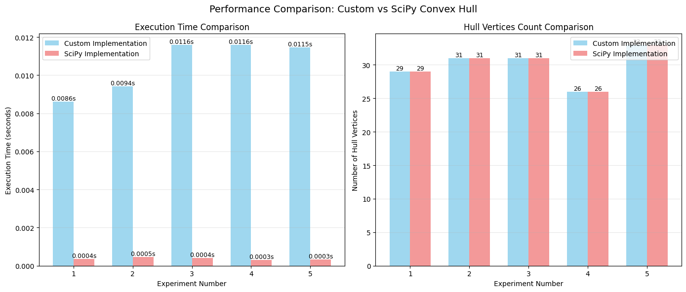

# Fecho Convexo 3D

| Informação  | Detalhes    |
| ----------- | ----------- |
| Disciplina  | Geometria Computacional (`INF2604`) |
| Professor   | Waldemar Celes (<celes@inf.puc-rio.br>) |
| Aluno       | Gabriel Ribeiro Gomes (<ggomes@inf.puc-rio.br>, <ribeiroggabriel@gmail.com>) |

## Sumário

- [Introdução e motivação](#introdução-e-motivação)
  - [O que é o Fecho Convexo?](#o-que-é-o-fecho-convexo)
  - [O Problema do Fecho Convexo 3D](#o-problema-do-fecho-convexo-3d)
- [Descrição Matemática](#descrição-matemática)
- [Algoritmos para Fecho Convexo 3D](#algoritmos-para-fecho-convexo-3d)
- [Resultados e Análises](#resultados-e-análises)
- [Conclusão](#conclusão)
- [Referências](#referências)

## Introdução e motivação

Geometria Computacional é uma área da ciência da computação que busca realizar o estudo e desenvolvimento de algoritmos para resolver problemas geométricos. Dentre uma quase infinidade de problemas geométricos, o problema do cálculo do fecho convexo (ou *Convex Hull*, em inglês) é um dos mais clássicos e fundacionais desse campo de estudo. Isso acontece porque o cálculo do fecho convexo aparece como sub-rotina em diversos outros algoritmos geométricos, como por exemplo o cálculo da triangulação de Delaunay, diagramas de Voronoi, testes de interseção, entre outros [1].

A motivação para a escolha do tema do fecho convexo 3D para estudo e implementação se dá pelo fato das suas mais diversas aplicações práticas em universos tridimensionais: modelos 3D em computação gráfica, nuvens de pontos obtidas por sensores (como LiDAR, scanners 3D ou fotogrametria), simulações físicas e aplicações em robótica. Especialmente, a aplicação do fecho convexo em motores de jogos e aplicações de realidade virtual é um campo de grande interesse, visto que o fecho convexo pode ser utilizado para simplificar a representação de objetos complexos, facilitando cálculos de colisão e interações físicas em ambientes virtuais [1,2].

Em motores de jogo, por exemplo, é comum aproximar objetos complexos por um ou mais volumes convexos, pois colisões entre corpos convexos podem ser testadas de forma muito mais eficiente e robusta do que colisões entre malhas arbitrárias. Em visão computacional, o fecho convexo de uma nuvem de pontos 3D pode servir como uma “envoltória” simples de um objeto, permitindo estimar seu volume, orientação e posição relativa a outros objetos na cena [2,3].


*Figura 1 – Exemplo de decomposição de malha 3D em malha de Fecho Convexo 3D. À esquerda, um modelo complexo; à direita, seu fecho convexo representado como um poliedro convexo.*

Do ponto de vista teórico, o problema do fecho convexo em dimensão fixa (como 2D ou 3D) é um dos problemas centrais da geometria computacional. Ele motivou o desenvolvimento de vários paradigmas algorítmicos: algoritmos incrementais, algoritmos de divisão e conquista, algoritmos do tipo *gift wrapping* e algoritmos como o *quickhull*, que combinam ideias de *divide-and-conquer* com seleção incremental de faces "mais externas" [1,4,5]. Em 3D, a dificuldade adicional em relação ao caso 2D está tanto na representação do fecho (um poliedro convexo ao invés de um polígono) quanto no tratamento de problemas numéricos e degenerescências (pontos coplanares, ruídos de medição, etc.).

Neste contexto, este trabalho tem como objetivo estudar o fecho convexo tridimensional sob três perspectivas principais:

1. Apresentar uma descrição matemática precisa do conceito de convexidade e de fecho convexo em três dimensões;
2. Descrever algoritmos clássicos para construção do fecho convexo 3D, com ênfase em um algoritmo incremental e no algoritmo Quickhull;
3. Apresentar os resultados dos algoritmos através de imagens e análises dos resultados gerados.

 e 3D (direita). No caso 2D, o fecho convexo é o polígono convexo que envolve todos os pontos. No caso 3D, o fecho convexo é o poliedro convexo que envolve todos os pontos.")

*Figura 2 – Exemplo de fecho convexo em 2D (esquerda) e 3D (direita). No caso 2D, o fecho convexo é o polígono convexo que envolve todos os pontos. No caso 3D, o fecho convexo é o poliedro convexo que envolve todos os pontos.*

### O que é o Fecho Convexo?

De maneira lúdica, podemos partir da imaginação de um conjunto de pontos aleatórios, ou estrelas, no céu. Considere que o fecho convexo desses pontos seja a forma mais simples que pode ser desenhada ao redor dessas estrelas, de modo que todas as estrelas fiquem dentro dessa forma. Em outras palavras, o fecho convexo é a menor “casca” ou “envoltória” que pode ser criada para englobar todos os pontos do conjunto.

Formalizando essa ideia, em 2D o fecho convexo de um conjunto finito de pontos pode ser visto como o menor polígono convexo que contém todos eles. Em 3D, a generalização natural é o menor poliedro convexo que contém o conjunto de pontos em $\mathbb{R}^3$. Esse poliedro é tipicamente representado por uma malha de triângulos (faces) cujos vértices pertencem ao conjunto de pontos original, e cuja união forma a superfície da casca convexa [1].

Outra forma útil de interpretar o fecho convexo é pela noção de combinação convexa: todo ponto do fecho convexo pode ser escrito como uma combinação convexa de pontos do conjunto original. Assim, ele não apenas “envolve” os pontos, mas também contém todos os pontos que podem ser formados como mistura convexa dos pontos originais.


*Figura 3 – Exemplo de fecho convexo aplicado a um objeto tridimensional complexo. À esquerda, o objeto original; à direita, o fecho convexo do objeto, representado como um poliedro convexo que envolve toda a geometria.*

### O Problema do Fecho Convexo 3D

O problema computacional do fecho convexo em 3D pode ser formulado da seguinte maneira:

- Entrada: um conjunto finito de $n$ pontos $S = \{p_1, p_2, \dots, p_n\}$, onde cada $p_i \in \mathbb{R}^3$.
- Saída: uma representação de um poliedro convexo $P \subset \mathbb{R}^3$ tal que:
  - $S \subseteq P$;
  - $P$ é convexo;
  - Se $Q$ é qualquer outro conjunto convexo que contém $S$, então $P \subseteq Q$.

Na prática, essa saída é frequentemente descrita por:

- Um subconjunto de vértices de $S$ que formam os vértices do poliedro convexo;
- Um conjunto de arestas (pares de vértices) que conectam vértices adjacentes;
- Um conjunto de faces (geralmente triangulares), cada uma definida por três vértices e uma orientação (normal externa).

Diversos algoritmos foram propostos para resolver esse problema em tempo polinomial. Em dimensão fixa (como 3D), é possível construir o fecho convexo em tempo $O(n \log n)$ em média, dependendo do algoritmo e da distribuição dos pontos [1,4,5]. No entanto, existem casos degenerados em que o número de faces do fecho convexo pode ser quadrático em relação ao número de pontos, o que influencia a complexidade no pior caso [1].

Além da complexidade assintótica, o problema em 3D traz desafios adicionais:

- Robustez numérica: operações que envolvem orientação e volume em 3D utilizam determinantes 3x3 ou 4x4, que podem ser sensíveis a erros de ponto flutuante;
- Degenerescências geométricas: pontos coplanares, colineares ou repetidos exigem tratamento especial na implementação;
- Estruturas de dados mais complexas: em 2D, basta manter uma lista ordenada de vértices do polígono; em 3D, é necessário lidar com um complexo de faces, arestas e vértices.

Apesar dessas dificuldades, bibliotecas modernas (como Qhull, CGAL, SciPy, entre outras) oferecem implementações robustas e amplamente utilizadas do fecho convexo em alta dimensão, com 3D sendo um caso de uso padrão [4,6].

 e seu fecho convexo (à direita), representado como um poliedro convexo com faces triangulares.")

*Figura 4 – Exemplo de nuvem de pontos 3D (à esquerda) e seu fecho convexo (à direita), representado como um poliedro convexo com faces triangulares.*

## Descrição Matemática

Nesta seção são apresentados os conceitos matemáticos fundamentais para definir convexidade e fecho convexo em $\mathbb{R}^3$, assim como algumas ferramentas algébricas usadas pelos algoritmos clássicos.

### Convexidade em $\mathbb{R}^3$

Considere um subconjunto $C \subset \mathbb{R}^3$. Dizemos que $C$ é convexo se, para quaisquer dois pontos $x, y \in C$, todo o segmento de reta que conecta $x$ a $y$ também está contido em $C$. Em notação matemática:

$$
C \text{ é convexo } \iff \forall x, y \in C, \forall t \in [0, 1],\; (1 - t)x + ty \in C.
$$

Esse conceito pode ser generalizado utilizando combinações convexas. Dados pontos $p_1, p_2, \dots, p_k \in \mathbb{R}^3$, uma combinação convexa é qualquer ponto da forma:

$$
x = \sum_{i=1}^{k} \lambda_i p_i, \quad \text{onde } \lambda_i \ge 0 \text{ e } \sum_{i=1}^{k} \lambda_i = 1
$$

Um conjunto $C$ é convexo se e somente se contém todas as combinações convexas de seus pontos [1,2].

### Definição de Fecho Convexo

Dado um conjunto finito de pontos $S = \{p_1, p_2, \dots, p_n\} \subset \mathbb{R}^3$, o fecho convexo de $S$, denotado por $\operatorname{conv}(S)$, é definido como o menor conjunto convexo que contém $S$. Equivalentemente [1,2]:

$$
\operatorname{conv}(S) = \left\{ \sum_{i=1}^{n} \lambda_i p_i \;\middle|\; \lambda_i \ge 0,\; \sum_{i=1}^{n} \lambda_i = 1 \right\}.
$$

Outra caracterização importante é:

$$
\operatorname{conv}(S) = \bigcap \{ C \subset \mathbb{R}^3 \mid C \text{ é convexo e } S \subseteq C \},
$$,

isto é, o fecho convexo é a interseção de todos os conjuntos convexos que contêm $S$. Essas definições são equivalentes e muito usadas tanto na teoria quanto na prática [2,3].

### Representação Poliedral do Fecho Convexo 3D

Em $\mathbb{R}^3$, o fecho convexo de um conjunto finito de pontos é um poliedro convexo. Um poliedro convexo pode ser descrito de duas maneiras principais [1]:

- Representação por vértices (forma V): como o fecho convexo de um conjunto finito de pontos $V = \{v_1, \dots, v_h\}$, ou seja, $P = \operatorname{conv}(V)$;
- Representação por semi-espaços (forma H): como interseção finita de semi-espaços do tipo:
  $$
  H_i = \{ x \in \mathbb{R}^3 \mid a_i \cdot x \le b_i \},
  $$
  de modo que $P = \bigcap_{i=1}^{m} H_i$.

Algoritmos de fecho convexo em geral recebem a entrada na forma V (um conjunto de pontos) e produzem uma estrutura intermediária que pode ser vista como uma descrição mista: um conjunto de vértices, mais faces triangulares orientadas, cada uma correspondendo a um semi-espaço que contém o poliedro. Internamente, muitos algoritmos mantêm ainda uma estrutura de adjacência entre faces, arestas e vértices, necessária para atualizar o poliedro durante a construção [1,3].

### Teste de Orientação em 3D (Volume Assinado)

Em 2D, o teste de orientação (esquerda/direita) é baseado no sinal de um determinante 2x2, que indica se três pontos estão orientados em sentido horário ou anti-horário. Em 3D, o análogo é o teste de orientação de quatro pontos $a, b, c, p \in \mathbb{R}^3$, que avalia o volume assinado do tetraedro $(a, b, c, p)$.

Esse volume pode ser calculado por meio do determinante 4x4:

$$
\text{orient3d}(a, b, c, p) =
\det
\begin{pmatrix}
a_x & a_y & a_z & 1 \\
b_x & b_y & b_z & 1 \\
c_x & c_y & c_z & 1 \\
p_x & p_y & p_z & 1
\end{pmatrix}.
$$

- Se $\text{orient3d}(a, b, c, p) > 0$, dizemos que $p$ está “acima” da face orientada $(a, b, c)$;
- Se $\text{orient3d}(a, b, c, p) < 0$, dizemos que $p$ está “abaixo” da face;
- Se $\text{orient3d}(a, b, c, p) = 0$, os quatro pontos são coplanares.

Esse teste é fundamental em algoritmos de fecho convexo 3D para determinar se uma face é visível a partir de um novo ponto inserido, e para garantir que as normais das faces estejam orientadas consistentemente para fora do poliedro [1,2].

## Algoritmos para Fecho Convexo 3D

Diversos algoritmos foram propostos para o cálculo do fecho convexo em 3D. Entre os mais conhecidos, destacam-se:

- Algoritmos incrementais: inserem um ponto por vez, atualizando o poliedro convexo atual;
- Algoritmos de divisão e conquista: dividem o conjunto de pontos em subconjuntos, constroem fechos parciais e depois os mesclam;
- Algoritmos do tipo gift wrapping (Jarvis march em 3D): “embrulham” o conjunto, construindo faces uma a uma;
- Quickhull: algoritmo prático amplamente utilizado, que generaliza a ideia do QuickHull 2D para dimensões maiores [4,5].

Nesta seção, serão descritos dois algoritmos que servem como base para a análise posterior: um algoritmo incremental em 3D e uma visão de alto nível do Quickhull 3D.

### Considerações de Complexidade

Em dimensão fixa, é possível obter algoritmos com tempo esperado de $O(n \log n)$ para a construção do fecho convexo, ao menos para distribuições de pontos razoáveis [1,4]. No entanto, o número de faces do fecho convexo pode ser grande em certos casos (por exemplo, quando muitos pontos estão próximos à superfície de uma esfera ou organizados em padrões “cilíndricos”), levando a um custo mais alto no pior caso. Em 3D, o número de faces $f$ pode ser da ordem de $O(n^2)$ em exemplos construídos artificialmente [1]. Assim, algoritmos *output-sensitive* passam a ser de interesse, com complexidade do tipo $O(n \log n + nf)$.

### Algoritmo Incremental 3D

A ideia do algoritmo incremental em 3D é generalizar o algoritmo incremental em 2D: começamos com um poliedro convexo inicial (tipicamente um tetraedro formado por 4 pontos em posição geral) e, a cada passo, inserimos um novo ponto, atualizando o fecho convexo para incluir esse ponto.

Passos principais:

1. Construção do tetraedro inicial:
   - Selecionar 4 pontos não coplanares do conjunto de entrada;
   - Construir um tetraedro com esses pontos e orientar suas faces para fora.

2. Laço incremental:
   - Para cada ponto restante $p$:
     - Determinar o conjunto de faces do poliedro atual que são visíveis de $p$, isto é, para as quais $\text{orient3d}(a, b, c, p) > 0$;
     - Remover essas faces visíveis;
     - Determinar a “fronteira” entre faces visíveis e não visíveis, isto é, as arestas que são adjacentes a exatamente uma face visível;
     - Para cada aresta da fronteira, criar uma nova face ligando a aresta ao ponto $p$, garantindo uma orientação consistente.

3. Resultado final:
   - Após inserir todos os pontos, o poliedro resultante é o fecho convexo do conjunto.

Esse algoritmo é conceitualmente simples e relativamente direto de implementar, mas exige cuidado com a estrutura de dados para manter a adjacência entre faces, arestas e vértices, e com a robustez numérica do teste `orient3d` [1,3].

### Quickhull 3D (Visão Geral)

O algoritmo Quickhull é uma generalização para dimensões maiores de uma ideia similar ao QuickHull em 2D e compartilha certa intuição com o QuickSort: em vez de inserir pontos um a um, ele seleciona faces “extremas” e particiona o conjunto de pontos em subconjuntos que serão tratados recursivamente [4,5].

A ideia simplificada em 3D é:

1. Encontrar um conjunto inicial de pontos “extremos” (por exemplo, pontos com coordenadas mínimas e máximas em cada eixo) que formam um poliedro inicial (tipicamente um tetraedro ou um poliedro pequeno);
2. Particionar o conjunto de pontos de acordo com as faces do poliedro inicial, associando a cada face o subconjunto de pontos que estão “do lado de fora” dessa face;
3. Recursivamente, para cada face com um conjunto não vazio de pontos associados:
   - Selecionar o ponto mais distante do plano da face;
   - Esse ponto define novas faces que “expandem” o poliedro;
   - Determinar as faces que se tornam visíveis desse novo ponto, e atualizar a estrutura de forma semelhante ao passo incremental;
   - Repartir os pontos associados e continuar recursivamente.

Na prática, implementações modernas de Quickhull (como a biblioteca Qhull) incluem diversos detalhes de otimização, tratamento de degenerescências e heurísticas, o que as torna muito eficientes e robustas para dados reais [4,6].

### Pseudocódigo dos principais algoritmos

A seguir, apresentamos um pseudocódigo de alto nível para os dois algoritmos discutidos: o algoritmo incremental 3D e uma versão simplificada do Quickhull 3D.

```code
ALGORITMO IncrementalConvexHull3D(P)
  Entrada: conjunto de pontos P = {p1, p2, ..., pn} ⊂ R^3
  Saída: estrutura Hull contendo faces triangulares orientadas

  1. Escolha quatro pontos não coplanares de P e forme um tetraedro inicial T
  2. Inicialize Hull com as 4 faces de T, orientadas para fora
  3. Para cada ponto p em P que não pertence a T:
       3.1. F_visiveis ← ∅
       3.2. Para cada face f = (a, b, c) em Hull:
              se orient3d(a, b, c, p) > 0 então
                 adicione f a F_visiveis
            fim-se
       3.3. Se F_visiveis está vazia:
              // p está dentro ou na superfície do fecho atual; ignore
              continue
            fim-se
       3.4. H_frontal ← conjunto de arestas que são adjacentes a exatamente
            uma face em F_visiveis (bordas entre faces visíveis e não visíveis)
       3.5. Remova de Hull todas as faces em F_visiveis
       3.6. Para cada aresta e = (u, v) em H_frontal:
              crie uma nova face f' = (u, v, p) com orientação "para fora"
              adicione f' a Hull
            fim-para
  4. Retorne Hull
FIM-ALGORITMO
```

```code
ALGORITMO QuickHull3D(P)
  Entrada: conjunto de pontos P = {p1, p2, ..., pn} ⊂ R^3
  Saída: estrutura Hull contendo faces triangulares orientadas

  1. Se |P| < 4:
       retorne um poliedro degenerado contendo P
  2. Escolha 4 pontos não coplanares para formar um tetraedro inicial T
  3. Inicialize Hull com as faces de T
  4. Para cada face f em Hull:
       associe a f o subconjunto de pontos S_f ⊆ P que estão "fora" de f
  5. Para cada face f em Hull tal que S_f não é vazio:
       ExpandirFace(f, S_f)

  PROCEDIMENTO ExpandirFace(f, S_f)
     1. Se S_f é vazio, retorne
     2. Escolha p ∈ S_f que maximiza a distância ao plano de f
     3. Determine o conjunto F_visiveis de faces de Hull visíveis a partir de p
     4. Determine o conjunto de arestas H_frontal na fronteira de F_visiveis
     5. Remova de Hull todas as faces em F_visiveis
     6. Para cada aresta e = (u, v) em H_frontal:
          crie nova face f' = (u, v, p) orientada para fora
          adicione f' a Hull
          compute S_f' = subconjunto de pontos de ⋃ S_g (g ∈ F_visiveis)
          que está "fora" de f'
          chame recursivamente ExpandirFace(f', S_f')
        fim-para
  FIM-PROCEDIMENTO
FIM-ALGORITMO
```

Esse pseudocódigo omite diversos detalhes de implementação (como escolha robusta do tetraedro inicial, tratamento de degenerescências e otimizações para evitar recomputar conjuntos de pontos), mas captura as ideias centrais de cada abordagem.

## Resultados e Análises

Os resultados desta pesquisa podem ser divididos em duas vertentes principais: (i) resultados teóricos relacionados à complexidade e às propriedades dos algoritmos de fecho convexo em 3D, e (ii) resultados experimentais qualitativos, obtidos a partir da implementação de versões simplificadas dos algoritmos e da comparação com bibliotecas consolidadas.

### Análise Teórica

Do ponto de vista teórico, alguns pontos importantes podem ser destacados a partir da bibliografia [1–5]:

1. Complexidade assintótica:
   - Muitos algoritmos para fecho convexo em dimensão fixa $d$ alcançam tempo esperado $O(n \log n)$, com dependência adicional do tamanho da saída (número de faces/vértices).
   - Em 3D, o número de faces do fecho convexo pode ser tão grande quanto $O(n^2)$ em exemplos específicos; assim, algoritmos *output-sensitive* são de interesse (por exemplo, $O(n \log n + nf)$).

2. Comparação entre algoritmos:
   - O algoritmo incremental é conceitualmente simples e relativamente fácil de implementar, mas sua complexidade no pior caso pode ser maior (potencialmente quadrática), e ele tende a ser mais sensível à ordem de inserção dos pontos [1,3].
   - O Quickhull é projetado para ser eficiente na prática, combinando heurísticas para escolha de pontos extremos com uma fase recursiva de expansão da casca. Ele é amplamente utilizado em bibliotecas como o Qhull, justamente por apresentar bom desempenho em dados reais e boa robustez numérica [4,6].

3. Robustez numérica:
   - Em 3D, o teste `orient3d` exige o cálculo de determinantes 4x4 ou o uso de produtos vetoriais/mistos. Em ponto flutuante, isso pode introduzir erros de arredondamento, levando a faces orientadas de maneira inconsistente ou a decisões geométricas incorretas.
   - A literatura sugere o uso de aritmética exata (por exemplo, frações racionais) ou de técnicas de filtragem numérica, o que aumenta o custo computacional, mas melhora a robustez [1–3].

4. Estruturas de dados:
   - A representação do fecho convexo em 3D requer uma estrutura de dados para o complexo de faces (faces, arestas, vértices e suas adjacências). Implementações eficientes utilizam estruturas como *half-edge* ou *DCEL* (*doubly connected edge list*), que facilitam percursos locais, atualizações e consultas [1,2].

### Experimentos e Observações Práticas (Visão Qualitativa)

Em implementações experimentais simples (por exemplo, em Python, utilizando representações diretas de faces e listas de adjacência), é possível observar alguns comportamentos típicos, de forma qualitativa:

1. Crescimento do tempo de execução com o número de pontos:
   - Para conjuntos de pontos gerados de forma aleatória em um cubo $[-1, 1]^3$, o número de pontos que efetivamente aparecem no fecho convexo tende a crescer mais lentamente do que $n$. Mesmo assim, o custo de cada atualização do algoritmo incremental cresce com o número de faces, o que faz com que o tempo total aumente de maneira aproximadamente super-linear.
   - Implementações baseadas em Quickhull tendem a escalar melhor na prática e se beneficiam de heurísticas para descartar rapidamente pontos que ficam no interior da casca.

2. Distribuição dos pontos e complexidade da casca:
   - Quando os pontos estão distribuídos de maneira uniforme no interior de um volume (por exemplo, um cubo), muitos ficam no interior, e a casca convexa é relativamente “simples” (poucos vértices em relação a $n$).
   - Quando os pontos se concentram próximos à superfície de uma esfera ou em uma camada fina, a casca convexa tende a ser muito mais complexa, com um número grande de faces e vértices, aproximando os piores casos teóricos.

3. Visualização:
   - Visualizações com pequenas nuvens de pontos (por exemplo, $n \approx 100$) permitem verificar intuitivamente a correção dos algoritmos, ao destacar apenas as faces externas e esconder os pontos internos.
   - Mesmo sem medidas numéricas sofisticadas, a visualização de exemplos aleatórios e de exemplos “patológicos” (pontos quase coplanares, conjuntos em forma de cilindro, etc.) já oferece uma boa noção da robustez e das limitações da implementação.


*Figura 5 – Exemplo de fecho convexo 3D para uma nuvem de 60 pontos aleatórios. À esquerda, a nuvem de pontos completa; à direita, apenas o fecho convexo é exibido.*


*Figura 6 – Exemplo de fecho convexo 3D para uma nuvem de 120 pontos aleatórios. À esquerda, a nuvem de pontos completa; à direita, apenas o fecho convexo é exibido.*

De modo geral, a análise qualitativa reforça as conclusões da literatura: algoritmos como o Quickhull são mais adequados para uso prático em aplicações que demandam desempenho e robustez, enquanto o algoritmo incremental é útil como ferramenta didática para compreender os conceitos básicos e para implementações em pequena escala.

Por fim, a título de curiosidade, comparei a performance do meu código simples de Quickhull 3D com a implementação da biblioteca SciPy (`scipy.spatial.ConvexHull`).



*Figura 7 – Comparação de tempo de execução entre a implementação simples de Quickhull 3D e a biblioteca SciPy para diferentes tamanhos de nuvem de pontos.*

## Conclusão

Neste trabalho, foi estudado o problema do fecho convexo em $\mathbb{R}^3$, um dos problemas centrais da geometria computacional. Começamos pela motivação, destacando que o fecho convexo aparece como sub-rotina em diversos algoritmos geométricos (como triangulação de Delaunay e diagramas de Voronoi) e possui aplicações diretas em computação gráfica, visão computacional e robótica, especialmente em tarefas de detecção de colisão e análise de forma [1–3].

Em seguida, apresentamos uma descrição matemática do conceito de convexidade e de fecho convexo, discutindo combinações convexas, caracterizações por interseção de conjuntos convexos e representações poliedrais do fecho convexo em 3D. Também foi introduzido o teste de orientação em 3D, baseado no volume assinado de tetraedros, que é a ferramenta algébrica central utilizada pelos algoritmos de construção.

Na parte algorítmica, discutimos dois paradigmas importantes: o algoritmo incremental 3D, que insere pontos um a um e atualiza a casca convexa com base em faces visíveis, e o Quickhull 3D, que utiliza uma abordagem recursiva e *output-sensitive*, expandindo o poliedro a partir de pontos extremos [1,4,5]. Apresentamos pseudocódigos de alto nível para ambas as abordagens, ressaltando suas ideias principais, vantagens e dificuldades de implementação.

Por fim, analisamos de forma teórica e qualitativa os resultados e comportamentos típicos desses algoritmos, observando a influência da distribuição dos pontos, da complexidade da casca e de questões de robustez numérica. A conclusão geral é que:

- O fecho convexo 3D é um objeto geométrico simples de definir, mas não trivial de calcular de forma robusta e eficiente para grandes conjuntos de pontos;
- Algoritmos incrementais são didaticamente valiosos e relativamente simples, porém podem ter custo elevado no pior caso;
- Algoritmos como o Quickhull, combinados com estruturas de dados adequadas e técnicas de robustez numérica, são a escolha preferencial em aplicações reais, o que explica seu uso em bibliotecas amplamente adotadas [4,6].

Como trabalhos futuros, seria natural aprofundar o estudo da relação entre fechos convexos e outros problemas de geometria computacional, como triangulação de Delaunay via *lifting* para dimensão 4, ou investigar implementações em bibliotecas de geometria robustas (como CGAL), comparando-as com versões didáticas em termos de desempenho e robustez. Outra extensão interessante seria estudar fechos convexos em dimensões maiores, que aparecem, por exemplo, em problemas de otimização convexa e aprendizado de máquina.

## Referências

[1] M. de Berg, O. Cheong, M. van Kreveld, M. Overmars. Computational Geometry: Algorithms and Applications, 3rd ed., Springer, 2008.

[2] F. P. Preparata, M. I. Shamos. Computational Geometry: An Introduction. Springer, 1985.

[3] H. Edelsbrunner. Algorithms in Combinatorial Geometry. Springer, 1987.

[4] C. B. Barber, D. P. Dobkin, H. Huhdanpaa. *The Quickhull Algorithm for Convex Hulls*. ACM Transactions on Mathematical Software, 22(4):469–483, 1996.

[5] S. Fortune, C. J. Van Wyk. *Efficient Exact Arithmetic for Computational Geometry*. In Proceedings of the Ninth Annual Symposium on Computational Geometry, 1993.

[6] Qhull Project. *Qhull: Computational Geometry – Convex Hulls, Delaunay Triangulations, Voronoi Diagrams*. Documentação online e implementação, disponível em bibliotecas como SciPy (`scipy.spatial.ConvexHull`).
