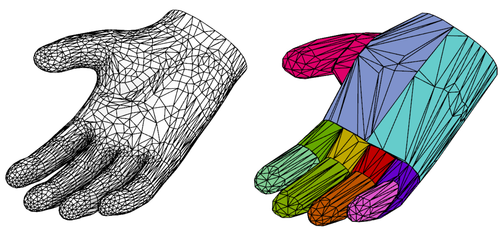
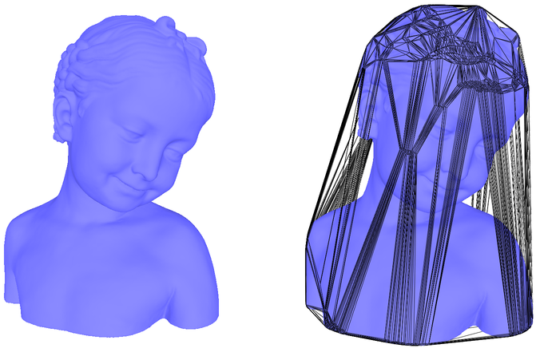
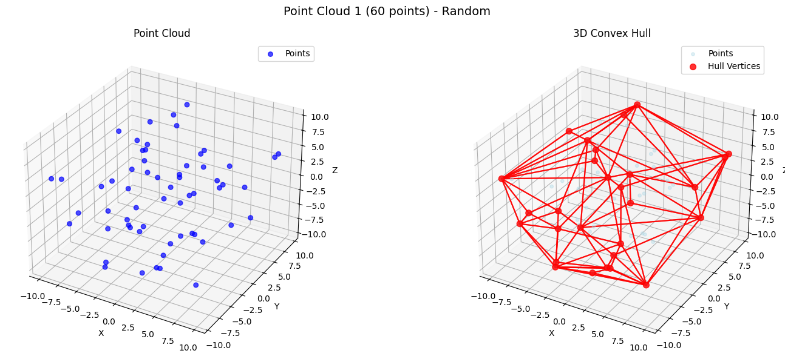
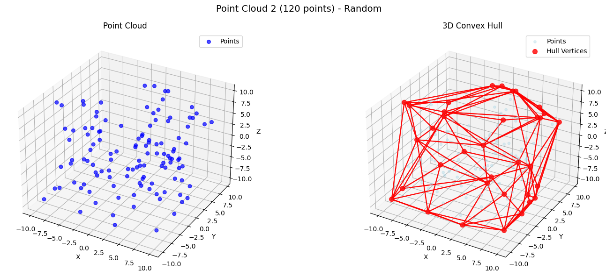

# Fecho Convexo 3D

| Informação  | Detalhes    |
| ----------- | ----------- |
| Disciplina  | Geometria Computacional (`INF2604`) |
| Professor   | Waldemar Celes (<celes@inf.puc-rio.br>) |
| Aluno       | Gabriel Ribeiro Gomes (<ggomes@inf.puc-rio.br>, <ribeiroggabriel@gmail.com>) |

## Sumário

- [Introdução e motivação](#introdução-e-motivação)
  - [O que é o Fecho Convexo?](#o-que-é-o-fecho-convexo)
  - [O Problema do Fecho Convexo 3D](#o-problema-do-fecho-convexo-3d)
- [Descrição Matemática](#descrição-matemática)
  - [Convexidade em 3D](#convexidade-em-3d)
  - [Definição de Fecho Convexo](#definição-de-fecho-convexo)
  - [Representação Poliedral do Fecho Convexo 3D](#representação-poliedral-do-fecho-convexo-3d)
  - [Teste de Orientação em 3D](#teste-de-orientação-em-3d)
- [Algoritmos para Fecho Convexo 3D](#algoritmos-para-fecho-convexo-3d)
  - [Considerações de Complexidade](#considerações-de-complexidade)
  - [Algoritmo Incremental 3D](#algoritmo-incremental-3d)
  - [Estrutura de Dados da Implementação](#estrutura-de-dados-da-implementação)
  - [Pseudocódigo do Algoritmo Implementado](#pseudocódigo-do-algoritmo-implementado)
- [Resultados e Análises](#resultados-e-análises)
  - [Experimento 1 - 60 pontos aleatórios em um cubo de lado 20 unidades](#experimento-1---60-pontos-aleatórios-em-um-cubo-de-lado-20-unidades)
  - [Experimento 2 - 120 pontos aleatórios em um cubo de lado 20 unidades](#experimento-2---120-pontos-aleatórios-em-um-cubo-de-lado-20-unidades)
  - [Experimento 3 - Comparação de Performance com SciPy (Quickhull)](#experimento-3---comparação-de-performance-com-scipy-quickhull)
- [Conclusão](#conclusão)
- [Referências](#referências)

## Introdução e motivação

Geometria Computacional é uma área da ciência da computação que busca realizar o estudo e desenvolvimento de algoritmos para resolver problemas geométricos. Dentre uma quase infinidade de problemas geométricos, o problema do cálculo do fecho convexo (ou *Convex Hull*, em inglês) é um dos mais clássicos e fundacionais desse campo de estudo. Isso acontece porque o cálculo do fecho convexo aparece como sub-rotina em diversos outros algoritmos geométricos, como por exemplo o cálculo da triangulação de Delaunay, diagramas de Voronoi, testes de interseção, entre outros [1,2].

A motivação para a escolha do tema do fecho convexo 3D para estudo e implementação se dá pelo fato das suas mais diversas aplicações práticas em universos tridimensionais: modelos 3D em computação gráfica, nuvens de pontos obtidas por sensores (como LiDAR, scanners 3D ou fotogrametria), simulações físicas e aplicações em robótica. Especialmente, a aplicação do fecho convexo em motores de jogos e aplicações de realidade virtual é um campo de grande interesse, visto que o fecho convexo pode ser utilizado para simplificar a representação de objetos complexos, facilitando cálculos de colisão e interações físicas em ambientes virtuais [1,3].

Em motores de jogo, por exemplo, é comum aproximar objetos complexos por um ou mais volumes convexos, pois colisões entre corpos convexos podem ser testadas de forma muito mais eficiente e robusta do que colisões entre malhas arbitrárias. Em visão computacional, o fecho convexo de uma nuvem de pontos 3D pode servir como uma “envoltória” simples de um objeto, permitindo estimar seu volume, orientação e posição relativa a outros objetos na cena [2,3].



*Figura 1 – Exemplo de decomposição de malha 3D em malha de Fecho Convexo 3D. À esquerda, um modelo complexo; à direita, seu fecho convexo 3D.*

Do ponto de vista teórico, o problema do fecho convexo em dimensão fixa (como 2D ou 3D) é um dos problemas centrais da geometria computacional. Ele motivou o desenvolvimento de vários paradigmas algorítmicos: algoritmos incrementais, algoritmos de divisão e conquista, algoritmos do tipo *gift wrapping* e algoritmos como o *quickhull*, que combinam ideias de *divide-and-conquer* com seleção incremental de faces "mais externas" [1,2,5,6]. Em 3D, a dificuldade adicional em relação ao caso 2D está tanto na representação do fecho (um poliedro convexo ao invés de um polígono) quanto no tratamento de problemas numéricos e degenerescências que o plano tridimensional pode trazer a mais (pontos coplanares, ruídos de medição, etc.).

Neste contexto, este trabalho tem como objetivo estudar o fecho convexo tridimensional sob três perspectivas principais:

1. Apresentar uma descrição matemática precisa do conceito de convexidade e de fecho convexo em três dimensões;
2. Implementar e analisar um algoritmo incremental para construção do fecho convexo 3D;
3. Apresentar os resultados do algoritmo através de imagens e análises comparativas com implementações consolidadas.

### O que é o Fecho Convexo?

De maneira lúdica, podemos partir da imaginação de um conjunto de pontos aleatórios, ou estrelas, no céu. Considere que o fecho convexo desses pontos seja a forma mais simples que pode ser desenhada ao redor dessas estrelas, de modo que todas as estrelas fiquem dentro dessa forma. Em outras palavras, o fecho convexo é a menor “casca” ou “envoltória” que pode ser criada para englobar todos os pontos do conjunto.

 e 3D (direita). No caso 2D, o fecho convexo é o polígono convexo que envolve todos os pontos. No caso 3D, o fecho convexo é o poliedro convexo que envolve todos os pontos.")

*Figura 2 – Exemplo de fecho convexo em 2D (esquerda) e 3D (direita). No caso 2D, o fecho convexo é o polígono convexo que envolve todos os pontos. No caso 3D, o fecho convexo é o poliedro convexo que envolve todos os pontos.*

Formalizando essa ideia, em 2D o fecho convexo de um conjunto finito de pontos pode ser visto como o menor polígono convexo que contém todos eles. Em 3D, a generalização natural é o menor poliedro convexo que contém o conjunto de pontos em $\mathbb{R}^3$. Esse poliedro é tipicamente representado por uma malha de triângulos (faces) cujos vértices pertencem ao conjunto de pontos original, e cuja união forma a superfície da casca convexa [1,2].

Outra forma útil de interpretar o fecho convexo é pela noção de combinação convexa: todo ponto do fecho convexo pode ser escrito como uma combinação convexa de pontos do conjunto original. Assim, ele não apenas “envolve” os pontos, mas também contém todos os pontos que podem ser formados como mistura convexa dos pontos originais.



*Figura 3 – Exemplo de fecho convexo aplicado a um objeto tridimensional complexo. À esquerda, o objeto original; à direita, o fecho convexo do objeto, representado como um poliedro convexo que envolve toda a geometria.*

### O Problema do Fecho Convexo 3D

O problema computacional do fecho convexo em 3D pode ser formulado da seguinte maneira:

- Entrada: um conjunto finito de $n$ pontos $S = \{p_1, p_2, \dots, p_n\}$, onde cada $p_i \in \mathbb{R}^3$.
- Saída: uma representação de um poliedro convexo $P \subset \mathbb{R}^3$ tal que:
  - $S \subseteq P$;
  - $P$ é convexo; e
  - Se $Q$ é qualquer outro conjunto convexo que contém $S$, então $P \subseteq Q$.

Essa saída também pode ser descrita como por:

- Um subconjunto de vértices de $S$ que formam os vértices do poliedro convexo;
- Um conjunto de arestas (pares de vértices) que conectam vértices adjacentes; e
- Um conjunto de faces (geralmente triangulares), cada uma definida por três vértices e uma orientação (normal externa).

Diversos algoritmos foram propostos para resolver esse problema em tempo polinomial. Em dimensão fixa (como 3D), é possível construir o fecho convexo em tempo $O(n \log n)$ em média, dependendo do algoritmo e da distribuição dos pontos [1,4,5]. No entanto, existem casos degenerados em que o número de faces do fecho convexo pode ser quadrático em relação ao número de pontos, o que influencia a complexidade no pior caso [1].

Além da complexidade assintótica, o problema em 3D traz desafios adicionais:

- Problemas com ponto flutuante devido operações que envolvem orientação e volume em 3D, que utilizam determinantes 3x3 ou 4x4, que podem se sensibilizar a esse tipo de problema;
- Degenerescências geométricas devido a pontos coplanares, colineares ou repetidos exigem tratamento especial na implementação; e
- Estruturas de dados mais complexas: em 2D, basta manter uma lista ordenada de vértices do polígono; em 3D, é necessário lidar com um complexo de faces, arestas e vértices.

Apesar dessas dificuldades, bibliotecas modernas (como Qhull, CGAL, SciPy, entre outras) oferecem implementações robustas e amplamente utilizadas do fecho convexo em alta dimensão, com 3D sendo um caso de uso padrão [4,6].

 e seu fecho convexo (à direita), representado como um poliedro convexo com faces triangulares.")

*Figura 4 – Exemplo de nuvem de pontos 3D (à esquerda) e seu fecho convexo (à direita), representado como um poliedro convexo com faces triangulares.*

## Descrição Matemática

Nesta seção são apresentados os conceitos matemáticos fundamentais para definir convexidade e fecho convexo em $\mathbb{R}^3$, assim como algumas ferramentas algébricas usadas pelos algoritmos clássicos.

### Convexidade em 3D

Considere um subconjunto $C \subset \mathbb{R}^3$. Dizemos que $C$ é convexo se, para quaisquer dois pontos $x, y \in C$, todo o segmento de reta que conecta $x$ a $y$ também está contido em $C$. Em notação matemática:

$$
C \text{ é convexo } \iff \forall x, y \in C, \forall t \in [0, 1],\; (1 - t)x + ty \in C.
$$

Esse conceito pode ser generalizado utilizando combinações convexas. Dados pontos $p_1, p_2, \dots, p_k \in \mathbb{R}^3$, uma combinação convexa é qualquer ponto da forma:

$$
x = \sum_{i=1}^{k} \lambda_i p_i, \quad \text{onde } \lambda_i \ge 0 \text{ e } \sum_{i=1}^{k} \lambda_i = 1
$$

Um conjunto $C$ é convexo se e somente se contém todas as combinações convexas de seus pontos [1,2].

### Definição de Fecho Convexo

Dado um conjunto finito de pontos $S = \{p_1, p_2, \dots, p_n\} \subset \mathbb{R}^3$, o fecho convexo de $S$, denotado por $\text{conv}(S)$, é definido como o menor conjunto convexo que contém $S$. Equivalentemente [1,2]:

$$
\text{conv}(S) = \{ \sum_{i=1}^{n} \lambda_i p_i \mid \lambda_i \ge 0,\; \sum_{i=1}^{n} \lambda_i = 1 \}.
$$

Outra caracterização importante é:

$$
\text{conv}(S) = \bigcap \{ C \subset \mathbb{R}^3 \mid C \text{ é convexo e } S \subseteq C \},
$$

isto é, o fecho convexo é a interseção de todos os conjuntos convexos que contêm $S$. Essas definições são equivalentes e muito usadas tanto na teoria quanto na prática [2,3].

### Representação Poliedral do Fecho Convexo 3D

Em $\mathbb{R}^3$, o fecho convexo de um conjunto finito de pontos é um poliedro convexo. Um poliedro convexo pode ser descrito de duas maneiras principais [1]:

- Representação por vértices (forma V): como o fecho convexo de um conjunto finito de pontos $V = \{v_1, \dots, v_h\}$, ou seja, $P = \text{conv}(V)$;
- Representação por semi-espaços (forma H): como interseção finita de semi-espaços do tipo: $H_i = \{ x \in \mathbb{R}^3 \mid a_i \cdot x \le b_i \}$, de modo que $P = \bigcap_{i=1}^{m} H_i$.

Algoritmos de fecho convexo em geral recebem a entrada na forma V (um conjunto de pontos) e produzem uma estrutura intermediária que pode ser vista como uma descrição mista: um conjunto de vértices, mais faces triangulares orientadas, cada uma correspondendo a um semi-espaço que contém o poliedro. Internamente, muitos algoritmos mantêm ainda uma estrutura de adjacência entre faces, arestas e vértices, necessária para atualizar o poliedro durante a construção [1,3].

### Teste de Orientação em 3D

Em 2D, o teste de orientação (esquerda/direita) é baseado no sinal de um determinante 2x2, que indica se três pontos estão orientados em sentido horário ou anti-horário. Em 3D, o análogo é o teste de orientação de quatro pontos $a, b, c, p \in \mathbb{R}^3$, que avalia o volume assinado do tetraedro $(a, b, c, p)$.

Esse volume pode ser calculado por meio do determinante 4x4:

$$
\text{orient3d}(a, b, c, p) =
\det
\begin{pmatrix}
a_x & a_y & a_z & 1 \\
b_x & b_y & b_z & 1 \\
c_x & c_y & c_z & 1 \\
p_x & p_y & p_z & 1
\end{pmatrix}.
$$

- Se $\text{orient3d}(a, b, c, p) > 0$, dizemos que $p$ está “acima” da face orientada $(a, b, c)$;
- Se $\text{orient3d}(a, b, c, p) < 0$, dizemos que $p$ está “abaixo” da face;
- Se $\text{orient3d}(a, b, c, p) = 0$, os quatro pontos são coplanares.

Esse teste é fundamental em algoritmos de fecho convexo 3D para determinar se uma face é visível a partir de um novo ponto inserido, e para garantir que as normais das faces estejam orientadas consistentemente para fora do poliedro [1,2,7].

## Algoritmos para Fecho Convexo 3D

Diversos algoritmos foram propostos para o cálculo do fecho convexo em 3D. Entre os mais conhecidos, destacam-se:

- Algoritmos incrementais: inserem um ponto por vez, atualizando o poliedro convexo atual;
- Algoritmos de divisão e conquista: dividem o conjunto de pontos em subconjuntos, constroem fechos parciais e depois os mesclam;
- Algoritmos do tipo gift wrapping (Jarvis march em 3D): "embrulham" o conjunto, construindo faces uma a uma;
- Quickhull: algoritmo prático amplamente utilizado, que generaliza a ideia do QuickHull 2D para dimensões maiores [4,5].

Nesta seção, será apresentado o algoritmo incremental em 3D implementado neste trabalho, que serve como base para os experimentos e análises posteriores.

### Considerações de Complexidade

Em dimensão fixa, é possível obter algoritmos com tempo esperado de $O(n \log n)$ para a construção do fecho convexo, ao menos para distribuições de pontos razoáveis [1,4,7]. No entanto, o número de faces do fecho convexo pode ser grande em certos casos (por exemplo, quando muitos pontos estão próximos à superfície de uma esfera ou organizados em padrões "cilíndricos"), levando a um custo mais alto no pior caso. Em 3D, o número de faces $f$ pode ser da ordem de $O(n^2)$ em exemplos construídos artificialmente [1,7]. Assim, algoritmos *output-sensitive* passam a ser de interesse, com complexidade do tipo $O(n \log n + nf)$.

### Algoritmo Incremental 3D

A ideia do algoritmo incremental em 3D é generalizar o algoritmo incremental em 2D: começamos com um poliedro convexo inicial (tipicamente um tetraedro formado por 4 pontos em posição geral) e, a cada passo, inserimos um novo ponto, atualizando o fecho convexo para incluir esse ponto.

Passos principais:

1. Construção do tetraedro inicial:
   - Selecionar 4 pontos não coplanares do conjunto de entrada;
   - Construir um tetraedro com esses pontos e orientar suas faces para fora.

2. Laço incremental:
   - Para cada ponto restante $p$:
     - Determinar o conjunto de faces do poliedro atual que são visíveis de $p$, isto é, para as quais $\text{orient3d}(a, b, c, p) > 0$;
     - Remover essas faces visíveis;
     - Determinar a “fronteira” entre faces visíveis e não visíveis, isto é, as arestas que são adjacentes a exatamente uma face visível;
     - Para cada aresta da fronteira, criar uma nova face ligando a aresta ao ponto $p$, garantindo uma orientação consistente.

3. Resultado final:
   - Após inserir todos os pontos, o poliedro resultante é o fecho convexo do conjunto.

Esse algoritmo é conceitualmente simples e relativamente direto de implementar, mas exige cuidado com a estrutura de dados para manter a adjacência entre faces, arestas e vértices, e com a robustez numérica do teste `orient3d` [1,3,7].

### Estrutura de Dados da Implementação

A implementação do algoritmo incremental neste trabalho utiliza uma estrutura de dados orientada a objetos que mantém a representação explícita do poliedro convexo através de:

Os componentes principais são [1]:

- **Vector**: Representa pontos no espaço 3D com operações básicas;
- **Vertex**: Encapsula um vetor com metadados para controle do algoritmo;
- **Edge**: Representa arestas com referências às faces adjacentes e vértices extremos;
- **Face**: Representa faces triangulares com referências aos vértices e arestas;
- **Hull**: Classe principal que coordena a construção incremental do fecho convexo.

Essa estrutura permite manter consistência topológica durante as atualizações incrementais, facilitando a identificação de faces visíveis e a criação de novas faces quando um ponto é adicionado ao fecho convexo.

### Pseudocódigo do Algoritmo Implementado

A seguir, apresentamos um pseudocódigo de alto nível para o algoritmo incremental 3D implementado neste trabalho:

```code
ALGORITMO IncrementalConvexHull3D(P)
  Entrada: conjunto de pontos P = {p1, p2, ..., pn} ⊂ R^3
  Saída: estrutura Hull contendo faces triangulares orientadas

  1. Escolha quatro pontos não coplanares de P e forme um tetraedro inicial T
  2. Inicialize Hull com as 4 faces de T, orientadas para fora
  3. Para cada ponto p em P que não pertence a T:
       3.1. F_visiveis ← ∅
       3.2. Para cada face f = (a, b, c) em Hull:
              se orient3d(a, b, c, p) > 0 então
                 adicione f a F_visiveis
            fim-se
       3.3. Se F_visiveis está vazia:
              // p está dentro ou na superfície do fecho atual; ignore
              continue
            fim-se
       3.4. H_frontal ← conjunto de arestas que são adjacentes a exatamente
            uma face em F_visiveis (bordas entre faces visíveis e não visíveis)
       3.5. Remova de Hull todas as faces em F_visiveis
       3.6. Para cada aresta e = (u, v) em H_frontal:
              crie uma nova face f' = (u, v, p) com orientação "para fora"
              adicione f' a Hull
            fim-para
  4. Retorne Hull
FIM-ALGORITMO
```

Este pseudocódigo captura a essência da implementação realizada, omitindo detalhes específicos de manutenção da estrutura de dados e tratamento de casos degenerados que estão presentes no código completo.

## Resultados e Análises

Foram realizadas 3 experimentações principais para avaliar o comportamento do algoritmo incremental implementado. Uma gerando uma nuvem aleatória de 60 pontos e outra com 120 pontos, ambas dentro de um cubo de lado 20 unidades. As imagens geradas mostram o fecho convexo resultante para cada conjunto de pontos. Além disso, foi feita uma simples comparação com a implementação do algoritmo Quickhull presente na biblioteca SciPy, observando qualitativamente o desempenho e a robustez dos dois algoritmos.

### Experimento 1 - 60 pontos aleatórios em um cubo de lado 20 unidades

Abaixo podemos ver a tabela com as métricas obtidas para o experimento com 60 pontos aleatórios:

| Metric                          | Value          |
| -----------------------         | -------------- |
| Total points                    | 60             |
| Coordinate bounds               | [-10.0, 10.0]  |
| Volume of bounding cube         | 8000.0         |
| Hull vertices                   | 28             |
| Hull faces                      | 52             |
| Hull edges                      | 78             |
| Execution time (s)              | 0.007436       |
| Vertices/second                 | 3765.4         |
| Hull complexity (% of points)   | 46.7%          |

Em seguida, as imagens geradas para o experimento:



*Figura 5 – Exemplo de fecho convexo 3D para uma nuvem de 60 pontos aleatórios. À esquerda, a nuvem de pontos completa; à direita, apenas o fecho convexo é exibido.*

### Experimento 2 - 120 pontos aleatórios em um cubo de lado 20 unidades

Abaixo podemos ver a tabela com as métricas obtidas para o experimento com 120 pontos aleatórios:

| Metric                  | Value          |
| ----------------------- | -------------- |
| Total points            | 120            |
| Coordinate bounds       | [-10.0, 10.0]  |
| Volume of bounding cube | 8000.0         |
| Hull vertices           | 35             |
| Hull faces              | 66             |
| Hull edges              | 99             |
| Execution time (s)      | 0.013108       |
| Vertices/second         | 2670.2         |
| Hull complexity (% of points)   | 29.2%        |

Em seguida, as imagens geradas para o experimento:



*Figura 6 – Exemplo de fecho convexo 3D para uma nuvem de 120 pontos aleatórios. À esquerda, a nuvem de pontos completa; à direita, apenas o fecho convexo é exibido.*

### Experimento 3 - Comparação de Performance com SciPy (Quickhull)

Comparação de performance entre a implementação incremental desenvolvida e a biblioteca SciPy (`scipy.spatial.ConvexHull`), utilizando nuvens de pontos de tamanhos variados (80 pontos em 5 experimentos distintos). Abaixo podemos ver as tabelas com os resultados obtidos:

| Exp | Points | Custom V | SciPy V | Match | Custom T | SciPy T |
| --- | ------ | -------- | ------- | ----- | -------- | ------- |
| 1   | 80     | 29       | 29      | 1     | 0.0086   | 0.0004  |
| 2   | 80     | 31       | 31      | 1     | 0.0094   | 0.0005  |
| 3   | 80     | 31       | 31      | 1     | 0.0116   | 0.0004  |
| 4   | 80     | 26       | 26      | 1     | 0.0116   | 0.0003  |
| 5   | 80     | 33       | 33      | 1     | 0.0115   | 0.0003  |

| Implementation        | Average time (s) | Std dev (s) | Min time (s) | Max time (s) |
| --------------------- | ---------------- | ----------- | ------------ | ------------ |
| Custom Implementation | 0.0105           | 0.0013      | 0.0086       | 0.0116       |
| SciPy Implementation  | 0.0004           | 0.0001      | 0.0003       | 0.0005       |

Comparação de velocidade (Incremental/SciPy-*QuickHull*): 28.57x

Em seguida, a comparação gráfica dos tempos de execução:

 para diferentes tamanhos de nuvem de pontos.")

*Figura 7 – Comparação de tempo de execução entre a implementação incremental desenvolvida e a biblioteca SciPy (Quickhull) para diferentes tamanhos de nuvem de pontos.*

## Conclusão

Neste trabalho, foi estudado o problema do fecho convexo em $\mathbb{R}^3$, um dos problemas centrais da geometria computacional. Começamos pela motivação, destacando que o fecho convexo aparece como sub-rotina em diversos algoritmos geométricos (como triangulação de Delaunay e diagramas de Voronoi) e possui aplicações diretas em computação gráfica, visão computacional e robótica, especialmente em tarefas de detecção de colisão e análise de forma [2–4].

Em seguida, apresentamos uma descrição matemática do conceito de convexidade e de fecho convexo, discutindo combinações convexas, caracterizações por interseção de conjuntos convexos e representações poliedrais do fecho convexo em 3D [1]. Também foi introduzido o teste de orientação em 3D, baseado no volume assinado de tetraedros, que é a ferramenta algébrica central utilizada pelos algoritmos de construção [1].

Na parte algorítmica, implementamos o algoritmo incremental 3D, que insere pontos um a um e atualiza a casca convexa com base em faces visíveis. Apresentamos um pseudocódigo de alto nível dessa abordagem, ressaltando suas ideias principais, vantagens e dificuldades de implementação. O algoritmo foi comparado empiricamente com a implementação Quickhull da biblioteca SciPy, que utiliza uma abordagem recursiva e *output-sensitive*, expandindo o poliedro a partir de pontos extremos [2,5,6].

Por fim, analisamos de forma teórica e qualitativa os resultados da implementação incremental, observando a influência da distribuição dos pontos, da complexidade da casca e de questões de robustez numérica. A conclusão geral é que:

- O fecho convexo 3D é um objeto geométrico simples de definir, mas não trivial de calcular de forma robusta e eficiente para grandes conjuntos de pontos;
- O algoritmo incremental implementado é didaticamente valioso e relativamente simples de compreender e implementar [1], porém apresenta limitações de performance em comparação com implementações otimizadas;
- Algoritmos como o Quickhull, combinados com estruturas de dados adequadas e técnicas de robustez numérica, são a escolha preferencial em aplicações reais, o que explica seu uso em bibliotecas amplamente adotadas como a SciPy [5,7].

Como trabalhos futuros, seria natural implementar o algoritmo Quickhull 3D para uma comparação direta entre implementações próprias de ambos os paradigmas.

## Referências

[1] W. Celes. *Fecho Convexo*. Material de aula da disciplina Geometria Computacional (INF2604), PUC-Rio, 2025.

[2] M. de Berg, O. Cheong, M. van Kreveld, M. Overmars. Computational Geometry: Algorithms and Applications, 3rd ed., Springer, 2008.

[3] F. P. Preparata, M. I. Shamos. Computational Geometry: An Introduction. Springer, 1985.

[4] H. Edelsbrunner. Algorithms in Combinatorial Geometry. Springer, 1987.

[5] C. B. Barber, D. P. Dobkin, H. Huhdanpaa. *The Quickhull Algorithm for Convex Hulls*. ACM Transactions on Mathematical Software, 22(4):469–483, 1996.

[6] S. Fortune, C. J. Van Wyk. *Efficient Exact Arithmetic for Computational Geometry*. In Proceedings of the Ninth Annual Symposium on Computational Geometry, 1993.

[7] Qhull Project. *Qhull: Computational Geometry – Convex Hulls, Delaunay Triangulations, Voronoi Diagrams*. Documentação online e implementação, disponível em bibliotecas como SciPy (`scipy.spatial.ConvexHull`).
